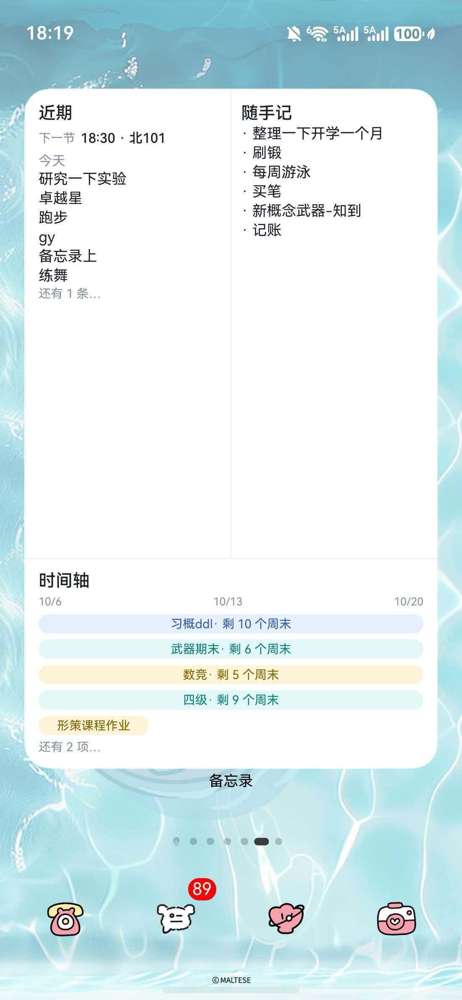
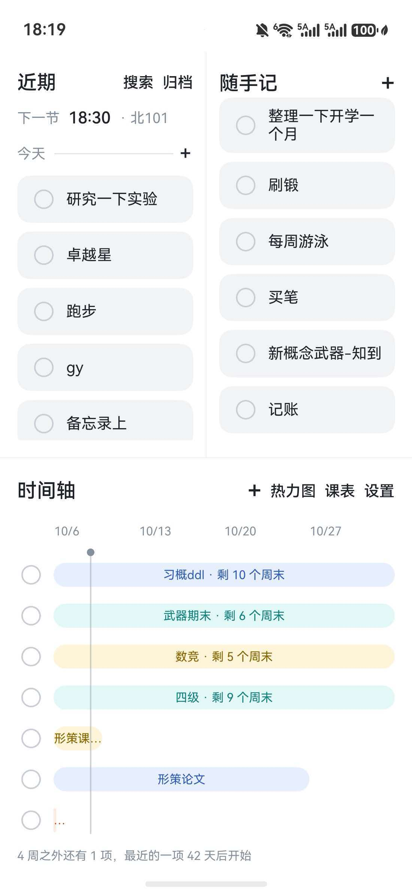

# 备忘录（MemoApp）

一款跑在鸿蒙手机和平板上的**自用备忘录**应用，ArkTS / ArkUI 开发。

它不是通用记事本——只服务三类事情：**当天必须做掉的**（课表、当天截止的事）、**临时随手记的**、**长期准备的**（期中、四级这类，挂上到期日）。三端（手机 / 平板 / Windows 配套端）数据经华为 AGC 云同步互通。

完整的产品需求文档见 [REQUIREMENTS-AUDIT.md](REQUIREMENTS-AUDIT.md)。

## 界面预览

| 桌面服务卡片 | App 主界面 |
|:---:|:---:|
|  |  |

手机桌面上的服务卡片不点开就能一眼看全三块内容；操作（拖动、删除、搜索、缩放时间轴）都在点开后的全屏里做。

## 主要功能

### 三块版面

- **近期**：窄列独立卡片。「今天」的事在上，「明天」的在下并明确标出。课表自动进入、当天截止的、长期到期自动生成的，都落在这一列。
- **随手记**：同样窄列。临时写下的东西，可以没有日期。
- **长期**：整宽区域。上方一根时间轴，每个长期任务一根横条（简化甘特），从开始日铺到截止日；点开后全屏可捏合缩放时间轴跨度、左右平移窗口。

桌面服务卡片（「今日备忘」）三块都显示，以查看为主；拖动排序、删除等操作在全屏里做。

### 课表

- 手工填一张周表，支持**单双周**、**调休**（允许改具体某一天的课，不内置节假日表）、**非整学期课**（起止周次）；连堂课算一条。
- 学期第一天是设置项，存云端三端共用。
- 每天自动展开到「今天」，不用手抄。

### 提醒（系统通知，三端都响）

- **每天 6:30**：推送当天「近期」里今天那段全部待办（非课表在前、课表垫底）。
- **到期前一天 6:30**：单独推一条该条目的预告，不并入当天汇总。
- 到期当天另有 6:30 / 11:30 / 16:05 三次催办。随手记（无日期）不推。

### 其他

- 本地 SQLite（relationalStore）+ AGC 端云结构化数据同步。
- 标签、搜索、归档、完成热力图。
- 到期规则：「长期」任务到期当天自动在「今天」生成待办；过期条目继续留在「近期」直到处理。

## 运行环境

| 项目 | 要求 |
|---|---|
| 开发工具 | DevEco Studio（支持 HarmonyOS 6.1.1 SDK 的版本，DevEco Studio 6.x） |
| SDK | HarmonyOS SDK 6.1.1（API 24）或以上 |
| HarmonyOS 版本 | 手机 / 平板均可（`deviceTypes: phone, tablet`） |
| 工程类型 | HarmonyOS 应用（Stage 模型） |

## 编译与运行

### 方式一：DevEco Studio（推荐）

1. 用 DevEco Studio 打开本工程目录。
2. **文件 → 项目结构 → 签名配置**，点「自动签名」（工程内不含可直接使用的签名材料，见下）。
3. 选中 `entry` 模块，点运行，安装到已连接的鸿蒙设备。

### 方式二：命令行（Windows PowerShell，实测可用）

```powershell
$env:Path = [System.Environment]::GetEnvironmentVariable("Path","Machine") + ";" + [System.Environment]::GetEnvironmentVariable("Path","User")
$env:DEVECO_HOME = "C:\Program Files\Huawei\DevEco Studio"
$env:DEVECO_SDK_HOME = "C:\Program Files\Huawei\DevEco Studio\sdk"   # 缺这行必失败
$env:JAVA_HOME = "C:\Program Files\Huawei\DevEco Studio\jbr"        # 缺这行打包阶段 spawn java ENOENT
$env:Path = "$env:JAVA_HOME\bin;" + $env:Path
Set-Location "<本工程目录>"
& "$env:DEVECO_HOME\tools\hvigor\bin\hvigorw.bat" `
    assembleHap --mode module -p product=default -p buildMode=debug --no-daemon
```

约 1–3 分钟，产物在 `entry/build/default/outputs/default/`。
**验证是否成功以产物文件时间戳为准，不要只看退出码。**

## 关于签名

`build-profile.json5` 中保留的签名配置来自开发机，**在其他电脑上不可用**（证书文件不在仓库内）。首次在本机构建前，请按上面的方式一重新配置自动签名。

## 目录结构

```
memo/
├── AppScope/                        # 应用级配置与图标
├── entry/
│   └── src/main/
│       ├── ets/
│       │   ├── pages/               # 界面：首页(Index)、课表、搜索、归档、热力图、设置
│       │   ├── logic/               # 业务逻辑：分区/排序、每日滚动、提醒、课表展开、拖拽
│       │   ├── data/                # 数据层：SQLite 表结构与读写（DbHelper）
│       │   ├── viewmodel/           # 界面展示模型
│       │   ├── widget/              # 桌面服务卡片
│       │   ├── entryformability/    # 卡片数据刷新
│       │   └── entryability/        # 主入口
│       ├── resources/               # 字符串 / 颜色 / 媒体资源
│       └── module.json5             # 模块配置与权限
├── build-profile.json5              # 构建与签名配置
└── REQUIREMENTS-AUDIT.md            # 完整产品需求文档
```

## 说明

- 本项目为个人自用工具，按需持续迭代，没有上架计划。
- 仅适配鸿蒙（HarmonyOS），不含 Android / iOS 版本。

## 许可证

本项目采用 [GNU General Public License v3.0](LICENSE)（GPL-3.0）。

你可以自由使用、修改、分发本项目代码；如果对外发布修改后的版本，需要同样以 GPL-3.0 开源，并保留原作者的版权声明。
